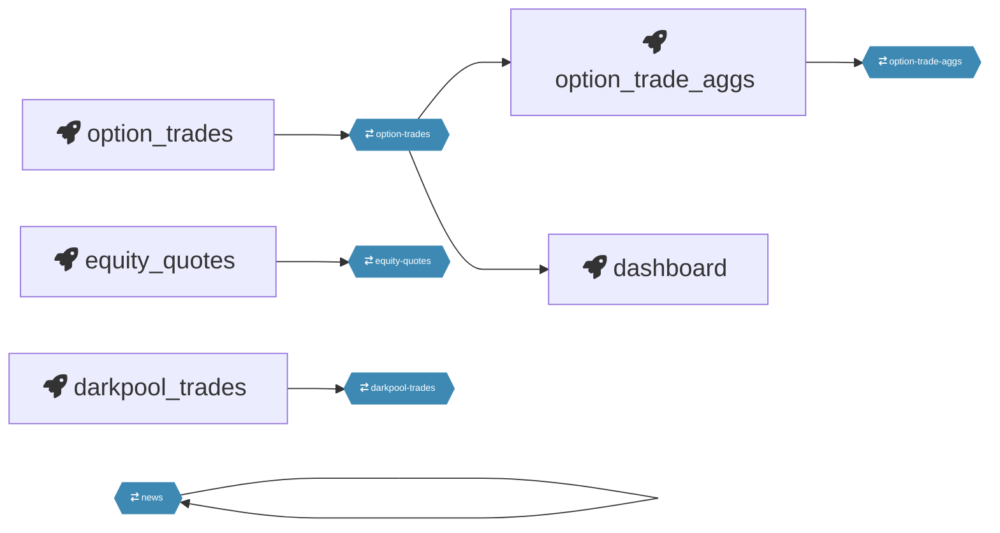

```mermaid
%%{ init: { 'flowchart': { 'curve': 'monotoneX' } } }%%
graph LR;
option_trades[fa:fa-rocket option_trades &#8205] --> option-trades{{ fa:fa-arrow-right-arrow-left option-trades &#8205}}:::topic;
option-trades{{ fa:fa-arrow-right-arrow-left option-trades &#8205}}:::topic --> option_trade_aggs[fa:fa-rocket option_trade_aggs &#8205];
option_trade_aggs[fa:fa-rocket option_trade_aggs &#8205] --> option-trade-aggs{{ fa:fa-arrow-right-arrow-left option-trade-aggs &#8205}}:::topic;
equity_quotes[fa:fa-rocket equity_quotes &#8205] --> equity-quotes{{ fa:fa-arrow-right-arrow-left equity-quotes &#8205}}:::topic;
option-trades{{ fa:fa-arrow-right-arrow-left option-trades &#8205}}:::topic --> dashboard[fa:fa-rocket dashboard &#8205];
news[fa:fa-rocket news &#8205] --> news{{ fa:fa-arrow-right-arrow-left news &#8205}}:::topic;
darkpool_trades[fa:fa-rocket darkpool_trades &#8205] --> darkpool-trades{{ fa:fa-arrow-right-arrow-left darkpool-trades &#8205}}:::topic;


classDef default font-size:110%;
classDef topic font-size:80%;
classDef topic fill:#3E89B3;
classDef topic stroke:#3E89B3;
classDef topic color:white;
```