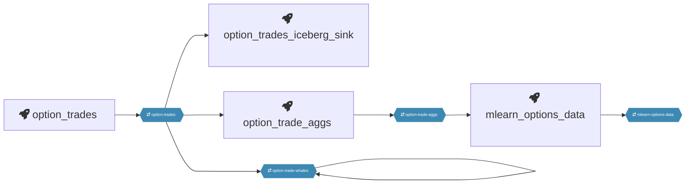

```mermaid
%%{ init: { 'flowchart': { 'curve': 'monotoneX' } } }%%
graph LR;
option_trades[fa:fa-rocket option_trades &#8205] --> option-trades{{ fa:fa-arrow-right-arrow-left option-trades &#8205}}:::topic;
option-trades{{ fa:fa-arrow-right-arrow-left option-trades &#8205}}:::topic --> option_trades_iceberg_sink[fa:fa-rocket option_trades_iceberg_sink &#8205];
option-trades{{ fa:fa-arrow-right-arrow-left option-trades &#8205}}:::topic --> option_trade_aggs[fa:fa-rocket option_trade_aggs &#8205];
option_trade_aggs[fa:fa-rocket option_trade_aggs &#8205] --> option-trade-aggs{{ fa:fa-arrow-right-arrow-left option-trade-aggs &#8205}}:::topic;
option-trade-aggs{{ fa:fa-arrow-right-arrow-left option-trade-aggs &#8205}}:::topic --> mlearn_options_data[fa:fa-rocket mlearn_options_data &#8205];
mlearn_options_data[fa:fa-rocket mlearn_options_data &#8205] --> mlearn-options-data{{ fa:fa-arrow-right-arrow-left mlearn-options-data &#8205}}:::topic;
option-trades{{ fa:fa-arrow-right-arrow-left option-trades &#8205}}:::topic --> option-trade-whales[fa:fa-rocket option-trade-whales &#8205];
option-trade-whales[fa:fa-rocket option-trade-whales &#8205] --> option-trade-whales{{ fa:fa-arrow-right-arrow-left option-trade-whales &#8205}}:::topic;


classDef default font-size:110%;
classDef topic font-size:80%;
classDef topic fill:#3E89B3;
classDef topic stroke:#3E89B3;
classDef topic color:white;
```